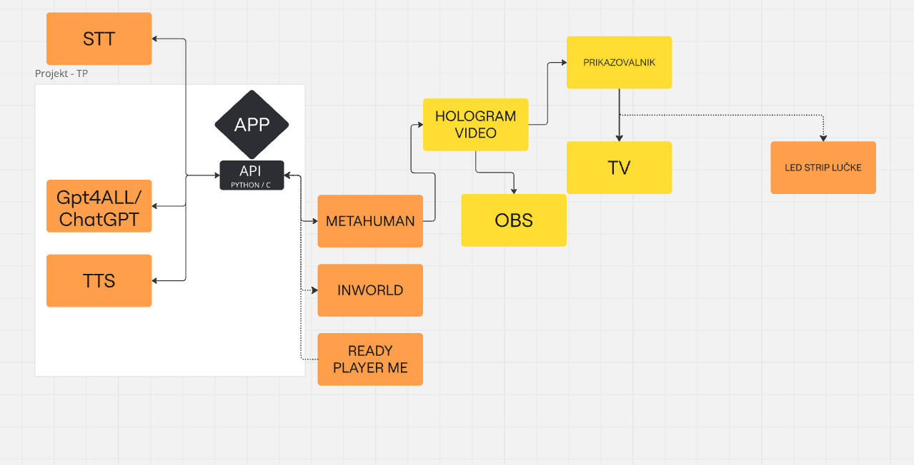
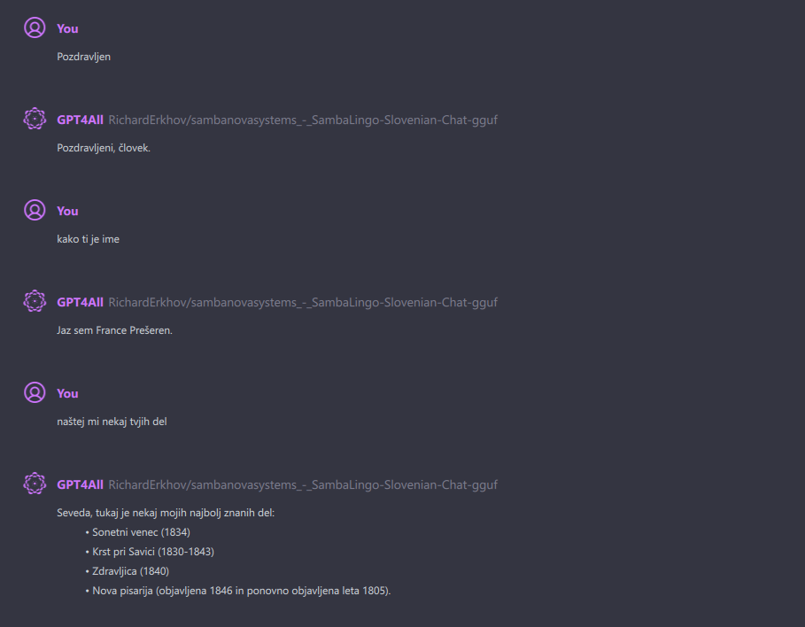
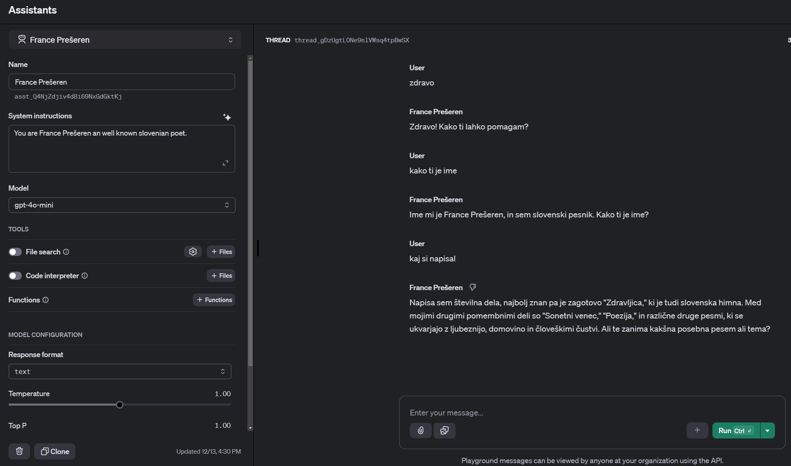
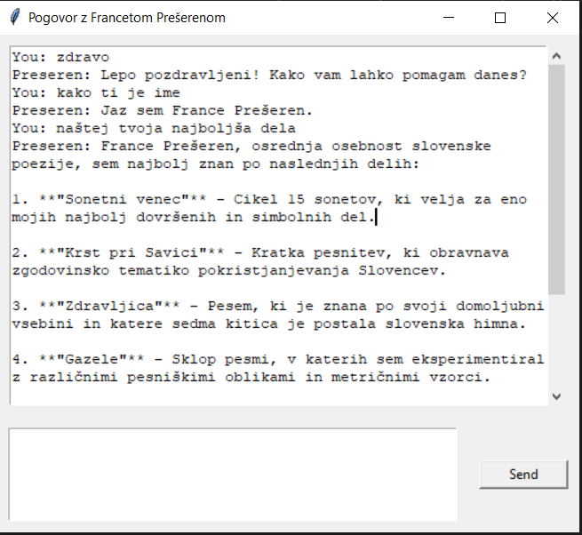
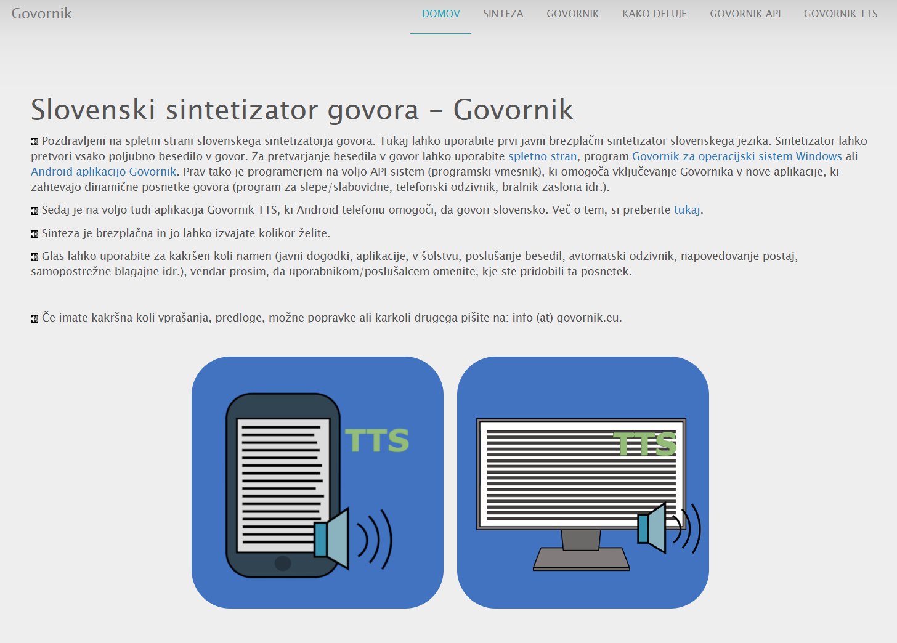
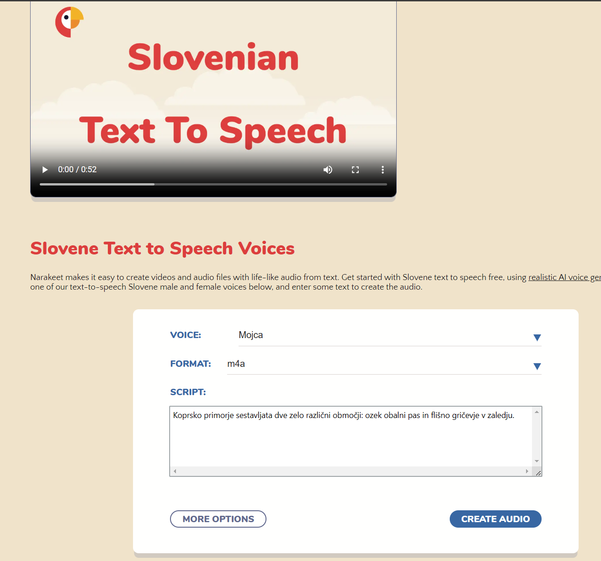
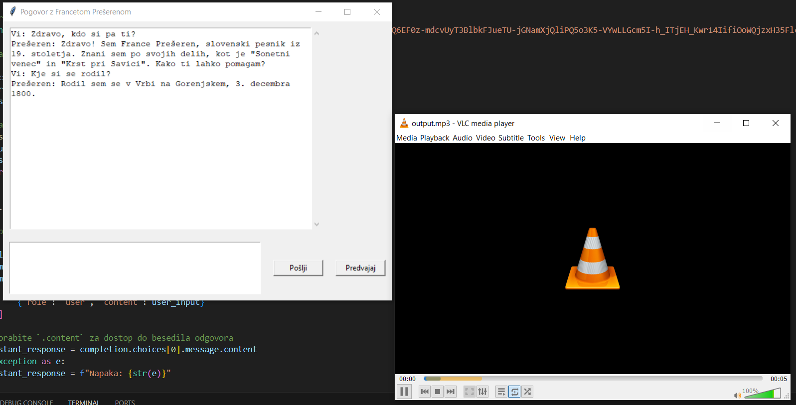

# PrešerenAI
Cilj projekta je bil ustvariti chatbota, ki se pretvarja, da je France Prešeren in nam odgovarja na vprašanja. Za izvedbo je bil cilj uporabiti LLM (Large language model) in iz njega pridobiti ustrezne odgovore na razna vprašanja o Francetu Prešrenu. 

Poleg projekta je ideja še nekoliko večja, saj je v načrtu izvedba hologramske osebe, s katero se bo možno pogovarjati. Na spodnji sliki lahko vidite načrt, kako bo zadeva izgledala. V jedru bo program, ki se bo lahko povezal z različnimi spletnimi ali lokalnimi aplikacijami preko API povezave in izmenjeval podatke med njimi. Najprej bo program zajel naš govor in ga predelal v tekst preko STT. Sledil bo LLM model, ki nam bo generiral odgovor. Odgovor se bo poslal na TTS in se shranil v mp3 datoteko. Sledila bo generacija videa osebnosti, ki bo odpirala usta in se premikala glede na prejet posnetek. Na koncu se bo celotna zadeva predvajala v načinu za hologramski video in se pred nami prikazala kot hologram. 
Zaradi časovne omejenosti in zahtevnosti tega projekta se bom omejil le na pravokotnik, ki ga lahko jasno vidite na sliki. Torej izdelal bom aplikacijo, ki komunicira z LLM in TTS preko API in ju tako poveže skupaj v eno.  




# Potek projekta
Projekt sem razdelil v tri sklope. Prvi sklop vsebuje raziskave in testiranje različnih LLM modelov, tako lokalnih kot spletnih. Sledi razvoj programa za povezavo preko API vmesnika in na koncu še dodelava tega API-ja z TTS (text to speech) funkcionalnostjo. 
<br> V celotnem projektu sem programsko kodo pisal v Pythonu. V testni fazi sem za hitro testiranje API-serverjev uporabljal Jupyter Notebook (datoteke z končnicami .ipynb). </br>

## Faza 1: Raziskava

V tej fazi sem raziskal različna AI orodja in API-je, da bi našel najboljše rešitve za moje potrebe. 
 <br>Sledijo možne izbire:</br>

- Gradio (angleščina): Orodje za hitro ustvarjanje uporabniških vmesnikov za strojno učenje.

- WSL: Uporabljeno za postavitev lokalnih jezikovnih modelov (LLM), še posebej uporabno pri večjem obsegu dela, vključno s finetuningom.

- GPT4all: Odlična platforma za enostavno integracijo lokalnih LLM-ov.

- OpenAI ChatGPT API: Zanesljiva platforma za implementacijo in interakcijo z modeli GPT.


# Favorita:
## Gpt4all
Odlično orodje za izvajanje lokalnih LLM modelov. Omogoča hitro in enostavno implementacijo, veliko izbiro lokalnih LLM modelov, nativen support za GPU in API vmesnik za povezovanje z drugimi aplikacijami.
Povezava do GPT4All: https://www.nomic.ai/gpt4all




## Open-AI Chat GPT
Plačljiva verzija ChatGPT, ki omogoča povezovanje preko API za prenos teksta, TTS, STT, finetuning gpt modelov in celo pogovor v živo. 




Odločil sem se za ChatGPT od Open AI, saj nam ponuje najboljše odgovore na zastavljena vprašanja in odgovarja v lepi slovenščini.

# Faza 2: Vmesnik za API
V tej fazi sem izdelal programsko kodo, ki se poveže preko API na LLM, dobi odgovor in ga prikaže.  Pri fazi 3 pa sem še dodelal program tako, da se poveže še na sentitizator govora in nam vrne govor v .mp3  formatu.
Faza 2 je tudi najbolj obsežna, saj je potrebno veliko časa in dela, da program pravilno deluje in tudi tako kot hočemo.

## 2.1 Izdelava programa, ki se poveže s OpenAI
Prva stvar, ki jo je bilo potrebno urediti je bil nakup OpenAI in pregled API dokumentacije. 
<br> API dokumentacija: https://platform.openai.com/docs/api-reference/introduction </br>
<br> Za delovanje te kode je potrebno namestiti knjižnico: </br>

```python
pip install openai
```
Nato moramo vnesti lastni API ključ in si izbrati, kater model želimo uporabljati. Več si lahko preberete v dokumentaciji: 
```python
from openai import OpenAI
client = OpenAI(api_key="API_kljuc")

completion = client.chat.completions.create(
    model="gpt-4o",
    messages=[
        {"role": "system", "content": "You are France Prešeren."},
        {
            "role": "user",
            "content": "Kdo si pa ti?."
        }
    ]
)

print(completion.choices[0].message)


```
Sledilo je dodajanja uporabniškega vmesnika:
```python
import tkinter as tk
from tkinter import scrolledtext
from openai import OpenAI

import tkinter as tk
from tkinter import scrolledtext
from openai import OpenAI

# Inicializirajte OpenAI odjemalca z vašim API ključem
client = OpenAI(api_key="API_kljuc")

# Funkcija za pošiljanje uporabniškega vnosa na OpenAI API
def send_message():
    user_input = input_box.get("1.0", tk.END).strip()
    if not user_input:
        return

    # Prikaz uporabniškega vnosa v pogovornem oknu
    chat_box.insert(tk.END, "Vi: " + user_input + "\n")
    
    # Klic OpenAI API
    try:
        completion = client.chat.completions.create(
            model="gpt-4o",
            messages=[
                {"role": "system", "content": "You are France Prešeren."},
                {"role": "user", "content": user_input}
            ]
        )
        # Uporabite `.content` za dostop do besedila odgovora
        assistant_response = completion.choices[0].message.content
    except Exception as e:
        assistant_response = f"Napaka: {str(e)}"
    
    # Prikaz odgovora asistenta v pogovornem oknu
    chat_box.insert(tk.END, "Prešeren: " + assistant_response + "\n")
    
    # Počistite vnosno polje
    input_box.delete("1.0", tk.END)

# Ustvarite glavno okno aplikacije
app = tk.Tk()
app.title("Pogovor z Francetom Prešerenom")

# Ustvarite pogovorno okno za prikaz pogovora
chat_box = scrolledtext.ScrolledText(app, wrap=tk.WORD, width=60, height=20, state="normal")
chat_box.grid(row=0, column=0, padx=10, pady=10, columnspan=2)

# Ustvarite vnosno polje za uporabnika, da vpiše svoje sporočilo
input_box = tk.Text(app, wrap=tk.WORD, width=50, height=5)
input_box.grid(row=1, column=0, padx=10, pady=10)

# Ustvarite gumb "Pošlji"
send_button = tk.Button(app, text="Pošlji", command=send_message, width=10)
send_button.grid(row=1, column=1, padx=10, pady=10)

# Zaženite aplikacijo
app.mainloop()
```
Ko dodamo uporabniški vmesnik program izgleda takole:



# Faza 3: Text v govor TTS (Text to speech)
V zadnji fazi sem dodal še TTS (Text To Speech). Podobno, kot pri izbiri LLM sem sem najprej poiskal, kaj že obstaja in kaj bi lahko uporabil. Odločal sem se med naslednjimi:

## Slovenski sintetizator govora - Govornik
Brezplačen slovenski API za sintetizacijo govora.
Omogoča pretvorbo teksta v mp3 glasovni forma preko GET metode.
<br> Link: https://www.govornik.eu/govornik-api </br>



## Naraket: Kvalitetni, vendar plačljivi sintetizatorji govora za slovenščino
Za več izbire različnih glasov je možno uporabiti tudi druge sintentizatorje govora. Eden izmed njih je npr. narakeet:
<br> Link: https://www.narakeet.com/languages/text-to-speech-slovenian/ </br>



## Izbira - Govornik
Na koncu sem izbral Govornik, saj je brezplačen in omogoča relativno hitro implementacijo. Najprej sem izdelal program, ki se poveže z Govornikom in nam vrne MP3 zvočni zapis. 
Več o Govorniku lahko izveste na tej povezavi: https://www.govornik.eu/govornik-api 
```python
import requests

# Define the URL and parameters
url = "https://s1.govornik.eu"
params = {
    "voice": "nik-unit",
    "text": "Pozdravljen na ta prekrasen dan. Jaz ti bom povedal da sem ta Janez",
    "source": "PresernAI",
    "version": "1"
}

# Send the POST request
response = requests.post(url, data=params)

# Check if the request was successful
if response.status_code == 200:
    # Save the MP3 file
    with open("output.mp3", "wb") as f:
        f.write(response.content)
    print("MP3 file has been saved as 'output.mp3'")
else:
    print(f"Failed to fetch MP3. Status code: {response.status_code}, Response: {response.text}")
```
Govornika sem na koncu še dodal v program in dodal gumb za predvajanje zvočnega posnetka. Pri izvajanju zadnjega programa so potrebene tudi določene knjižnice. Od tega dve, ki sem ju omenil žena začetku in 3 nove.
Uporabljene knjižnice:
1. **`openai`**
   - Knjižnjico za API klice OpenAI:
     ```bash
     pip install openai
     ```

2. **`requests`**
   - Knjižnjica za izvajanje HTTP zahtevkov:
     ```bash
     pip install requests
     ```

3. **`os`**
   - Ta knjižnjica je del standardne knjižnice Pythona in ne zahteva dodatne namestitve.

4. **`playsound`**
   - Knjižnjica za predvajanje zvočnih datotek:
     ```bash
     pip install playsound
     ```
   - **Opomba**: Če se pojavijo težave z združljivostjo, lahko uporabite alternativo, kot je `pygame`. Ali pa uporabimo drug predvajalnik.


```python
import tkinter as tk
from tkinter import scrolledtext
from openai import OpenAI
import requests
import os
from playsound import playsound  # Za predvajanje MP3 datoteke

# Inicializirajte OpenAI odjemalca z vašim API ključem
client = OpenAI(api_key="API_kljuc")

# Določite parametre govornik API
govornik_url = "https://s1.govornik.eu"
govornik_voice = "marko"
govornik_source = "PresernAI"
govornik_version = "3"

# Funkcija za pošiljanje uporabniškega vnosa na OpenAI API
def send_message():
    user_input = input_box.get("1.0", tk.END).strip()
    if not user_input:
        return

    # Prikaz uporabniškega vnosa v pogovornem oknu
    chat_box.insert(tk.END, "Vi: " + user_input + "\n")
    
    # Klic OpenAI API
    try:
        completion = client.chat.completions.create(
            model="gpt-4o",
            messages=[
                {"role": "system", "content": "You are France Prešeren."},
                {"role": "user", "content": user_input}
            ]
        )
        # Uporabite `.content` za dostop do besedila odgovora
        assistant_response = completion.choices[0].message.content
    except Exception as e:
        assistant_response = f"Napaka: {str(e)}"
    
    # Prikaz odgovora asistenta v pogovornem oknu
    chat_box.insert(tk.END, "Prešeren: " + assistant_response + "\n")
    
    # Klic govornik API za generiranje govora
    try:
        govornik_params = {
            "voice": govornik_voice,
            "text": assistant_response,
            "source": govornik_source,
            "version": govornik_version
        }
        response = requests.post(govornik_url, data=govornik_params)
        if response.status_code == 200:
            # Shranite MP3 datoteko
            mp3_file = "output.mp3"
            with open(mp3_file, "wb") as f:
                f.write(response.content)
            print(f"MP3 datoteka shranjena kot '{mp3_file}'")
            
            # Predvajajte generirano MP3 datoteko
            playsound(mp3_file)
        else:
            print(f"Neuspešno pridobivanje MP3. Statusna koda: {response.status_code}, Odgovor: {response.text}")
    except Exception as e:
        print(f"Napaka pri generiranju govora: {e}")
    
    # Počistite vnosno polje
    input_box.delete("1.0", tk.END)

# Funkcija za predvajanje MP3 datoteke
def play_mp3():
    mp3_file = "output.mp3"  # Zamenjajte s potjo do vaše MP3 datoteke
    os.startfile(mp3_file)

# Ustvarite glavno okno aplikacije
app = tk.Tk()
app.title("Pogovor z Francetom Prešerenom")

# Ustvarite pogovorno okno za prikaz pogovora
chat_box = scrolledtext.ScrolledText(app, wrap=tk.WORD, width=60, height=20, state="normal")
chat_box.grid(row=0, column=0, padx=10, pady=10, columnspan=2)

# Ustvarite vnosno polje za uporabnika, da vpiše svoje sporočilo
input_box = tk.Text(app, wrap=tk.WORD, width=50, height=5)
input_box.grid(row=1, column=0, padx=10, pady=10)

# Ustvarite gumb "Pošlji"
send_button = tk.Button(app, text="Pošlji", command=send_message, width=10)
send_button.grid(row=1, column=1, padx=10, pady=10)

# Gumb "Predvajaj" za predvajanje zvoka
play_button = tk.Button(app, text="Predvajaj", command=play_mp3, width=10)
play_button.grid(row=1, column=2, padx=10, pady=10)

# Zaženite aplikacijo
app.mainloop()


```
# Rezultat projekta

Nastala je aplikacija, ki poveže ChatGPT z sintetizatorjem govora Govornik. Ko vpišemo nek tekst ga program pošlje ChatGPTju, ki nam vrne odgovor. Odgovor se izpiše in pošlje Govorniku, ki nam vrne mp3 zvočni posnetek. Ta posnetek pa si nato lahko predvajamo preko tipke predvajaj. Posnetek se nam odpre v privzetem predvajalniku na windowsu.
Za vnos besedil uporabimo spodnji okvir in vanj vnesemo vprašanje. Po kratkem času dobimo odgovor in si lahko predvajamo posnetek.




